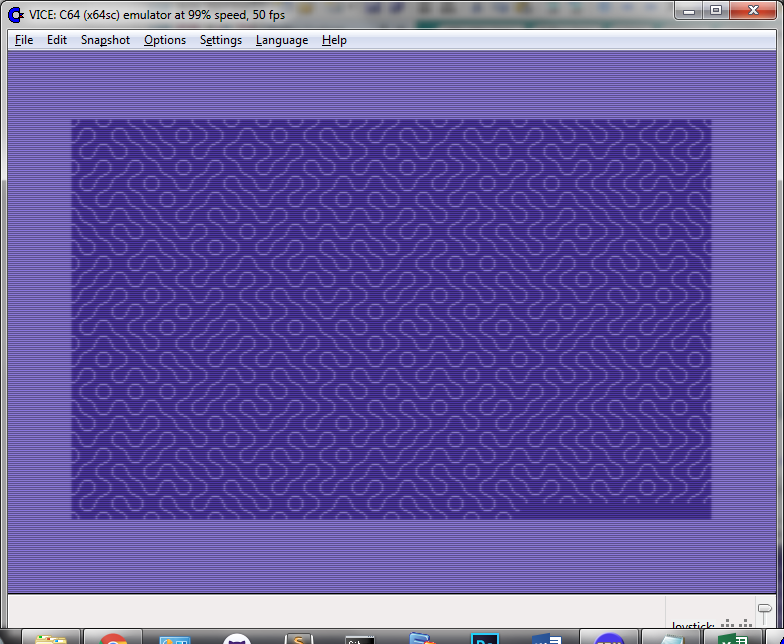
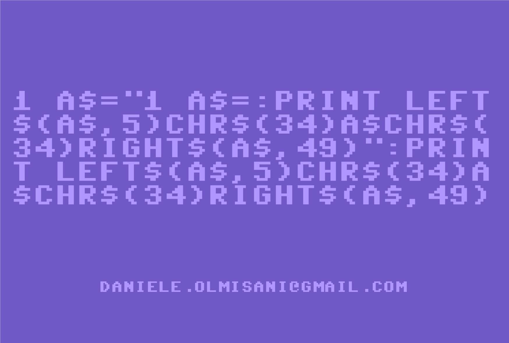
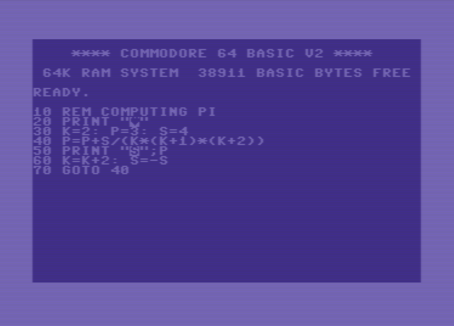

C64 CodeArt
===========

by Daniele Olmisani
and the contributions of @JaganGanesh

Please, see [LICENSE](LICENSE) file.

### Hello World!
```bas
PRINT "HELLOWORLD!"
```

### The Basics of BASIC

#### Simple Arithmetic

```bas
PRINT 3+3, 3-3, 3*3, 3/3, 3^3
```

Operator are evaluated left-to-right with this predence order: ^, */, +-.

```bas
PRINT 9*8+7+6^5/4-3-2+1
```


#### Built-in Functions

Square function and natural logarithm with the basis E

```bas
PRINT SQR(4), 4*4
```

```bas
PRINT LOG(1), LOG(100)/LOG(10)
```

#### Build-in Constants

Pi value

```bas
PRINT {PI}
```

### Logic operations

Equality operators =, <>, >, >.

```bas
PRINT 1=1, 1=0, 1<>1, 1<>0
```

```bas
PRINT 1>0, 1<0
```

True and False values are represented by numeric values -1 and 0.

Built-in operators AND, OR and NOT.

```bas
PRINT 0 AND 0, -1 AND 0, 0 AND -1=1, -1 AND -1
```

```bas
PRINT 0 OR 0, -1 OR 0, 0 OR -1=1, -1 OR -1
```

```bas
PRINT NOT 0, NOT -1
```

XOR operator is not included but it shall be derived using formula (p|q) & ~(p&q).

```bas
10 PRINT "P", "Q", "P XOR Q"
20 FOR P=0 TO 1
30 FOR Q=0 TO 1
40 : PRINT P, Q, (P OR Q) AND NOT(P AND Q)
50 NEXT Q
60 NEXT P
```

#### FOR-NEXT Loop
```bas
10 FOR I = 1 TO 4
20 PRINT "HELLOWORLD!"
30 NEXT I
```

#### INPUT Variables
```bas
10 DIM A$(1)
20 PRINT "PRESS RETURN TO CONTINUE"
30 INPUT A$
```

```bas
10 DIM N$(40)
20 PRINT "WHAT IS YOUR NAME: ";
30 INPUT N$
40 PRINT "HELLO, "; N$
```

#### IF Condition
```bas
10 DIM A$(4)
20 PRINT "DO YOU LIKE C64: ";
30 INPUT A$
40 IF A$ = "YES" THEN 60
50 END
60 PRINT "GREAT!"
70 GOTO 50
```

#### Random Numbers
```bas
10 PRINT RND(1)
```

```bas
10 PRINT INT(10*RND(1) + 1)
```

#### GOSUB
```bas
10  PRINT "HELLO"
20  GOSUB 100
30  END
100 PRINT "WORLD"
110 RETURN
```

#### Generate random patterns with Commodore 64.

```basic
100 REM CODE-ART
110 REM DANIELE.OLMISANI@GMAIL.COM
120 PRINT "{CLEAR}"
130 REM PUT CHAR MAP AT 12288
140 POKE 53272, (PEEK(53272) AND 240)+12
150 REM DEFINE NEW CHARS
160 FOR K=0 TO 15
170  : READ A
180  : POKE 12288+K, A
190 NEXT K
200 REM DRAW RAND PATTERNS
210 PRINT CHR$(64.5+RND(1));
220 GOTO 210
230 REM CHARACTER DATA
240 DATA 016,016,032,192,003,004,008,008
250 DATA 008,008,004,003,192,032,016,016
```




Obviously inspired from the famous `10 PRINT CHR$(205.5+RND(1)); : GOTO 10`


#### Random music
```bas
10 POKE 54272+RND(1)*25,RND(1)*256 : GOTO 10
```

#### Is this a correct statement?
This is a correct statement but it returns the same message as `jfglajda`. So it is a correct statement or not?

##### Trivial version
```bas
PRINT "{DOWN}?SYNTAX  ERROR";
```

The `{DOWN}` character is obtained by pressing the down cursor key

##### Expert version

```bas
POKE781,11:SYS58251
```

Set the register X with value 11, then call the error routine (X=11 handles Syntax Error). Thanks to [palordrolap](https://www.reddit.com/user/palordrolap).

#### Make a click sound
```bas
POKE 54296,15:POKE 54296,0
```

#### Quines

A quine is a non-empty computer program which takes no input and produces a copy of its own source code as its only output. [Wikipedia](https://en.wikipedia.org/wiki/Quine_%28computing%29)

#### Cheating quine
```bas
10 LIST
```

#### Actual quine
```bas
1 A$="1 A$=:PRINT LEFT$(A$,5)CHR$(34)A$CHR$(34)RIGHT$(A$,49)":PRINT LEFT$(A$,5)CHR$(34)A$CHR$(34)RIGHT$(A$,49)
```




<!---
**TBV**
```bas
10 READ A$:PRINT 10 A$:PRINT 20 "DATA" A$
20 DATA READ A$:PRINT 10 A$:PRINT 20 "DATA" A$
```
--->

#### Computing PI
```bas
10 REM COMPUTING PI (NILAKANTHA SERIES) 
20 PRINT "{CLEAR}"
30 K=2: P=3: S=4
40 P=P+S/(K*(K+1)*(K+2))
50 PRINT "{HOME}";P
60 K=K+2: S=-S
70 GOTO 40
```




Otherwise, by cheating
```bas
PRINT {PI}
```

#### Hofstadter Q sequence

```bas
100 REM HOFSTADTER Q NUMBERS
110 DIM Q(1000)
120 Q(1)=1 : Q(2)=1
130 FOR N=3 TO 1000
140 : Q(N) = Q(N-Q(N-1)) + Q(N-Q(N-2))
150 NEXT N
160 PRINT "FIRST NUMBERS: ";
170 FOR I=1 TO 10
180 : PRINT Q(I);
190 NEXT I
200 PRINT
210 PRINT "1000th NUMBER: "; Q(1000)
```

#### Fibonacci Numbers
```bas
10 REM FIBONACCI NUMNBERS
20 A=1: B=1
30 PRINT A; B;
40 FOR I=3 TO 15
50 T=A+B: A=B: B=T
60 PRINT T;
70 NEXT
```

#### Memory Worm
```bas
10 POKE RND(1)*65536, RND(1)*256 : GOTO 10
```

#### Random stuff
```bas
10 P=RND(1)*1000 : POKE 1024+P, RND(1)*128 : POKE 55296+P, RND(1)*16 : GOTO 10
```

#### Timing stuff
Prints timer ticks since Power-On (1 Tick = 1/60 Second)
```bas
PRINT TIME
```
 
Prints timer since Power-On in Hour/Minute/Second Format
```bas
PRINT TIME$
```
The accuracy of the timer is very poor (>1% drift)

#### Soft reset
```bas
SYS 64738
```


